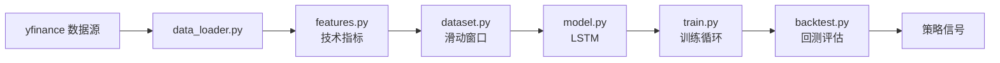

# 项目架构

## 整体设计

## 模块说明

### 数据层（src/data_loader.py）
- 从 yfinance 拉取 OHLCV 数据
- 缺失值处理、基础清洗
- 输出标准化 DataFrame

### 特征层（src/features.py）
- 技术指标：MA、RSI、MACD、布林带
- 收益率特征：Return_1d、Return_5d、Log_Return
- 输出可用于建模的特征矩阵

### 数据集层（src/dataset.py）
- PyTorch `StockSequenceDataset`
- 滑动窗口采样：过去 N 天特征 → 第 N+1 天目标
- 形状：(N, window_size, n_features)

### 模型层（src/model.py）
- 双层 LSTM（128→64 hidden units）
- Dropout 0.2 正则化
- Dense head：32 → 1

### 训练层（src/train.py）
- Huber Loss（对金融噪声更鲁棒）
- Adam 优化器 + ReduceLROnPlateau 调度
- Early Stopping 防过拟合

### 回测层（src/backtest.py）
- 简单策略：预测上涨 → 满仓，下跌 → 清仓
- 评估指标：累计收益、夏普比率、最大回撤

## 数据流

1. **拉取数据**：`python run_demo.py` 自动从 yfinance 拉取 AAPL 历史
2. **特征工程**：生成 13 个技术指标特征
3. **切分滑动窗口**：60 天窗口 → 次日目标
4. **训练**：50 epochs，batch=32
5. **回测**：在测试集上跑策略
6. **评估**：输出方向准确率、夏普比率

## 关键技术决策

| 决策 | 备选 | 选择 | 原因 |
|------|------|------|------|
| 损失函数 | MSE / CrossEntropy | **Huber** | 金融数据有极端值，Huber 对异常更鲁棒 |
| 窗口大小 | 20 / 60 / 120 | **60** | 季度级别数据，行业经验值 |
| 模型 | LSTM / Transformer | **LSTM** | 训练数据有限，LSTM 更稳定 |
| 优化器 | SGD / Adam | **Adam** | 自适应学习率，收敛快 |
| 训练框架 | 单 GPU / 多 GPU | **单 GPU / CPU** | 数据规模小，复杂度低 |

## 性能基线

在 AAPL 2015-2024 数据上的示例结果：

| 指标 | 数值 |
|------|------|
| RMSE | ~12.3 |
| 方向准确率 | ~54.7% |
| 夏普比率 | 视区间而定 |

> ⚠️ **重要**：单一资产、单一时间段的回测结果不具有统计显著性，仅作示例。
